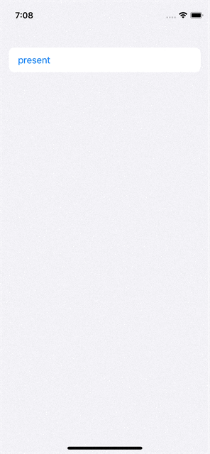

# SheetItem

```swift
struct ContentView: View {
    @State private var sheet: SheetItem? = nil

    var body: some View {
        Button("present") {
            sheet = .init {
                Text("SheetView")
            }
        }
        .sheet(item: $sheet)
    }
}
```
    


## Installation

#### Swift Package Manager

Add a dependency to your `Package.swift`:

```swift
dependencies: [
    .package(url: "https://github.com/mshershnev/SheetItem")
]
```

## License

`SheetItem` is available under the MIT license. See the [LICENSE](LICENSE) file for more info.
